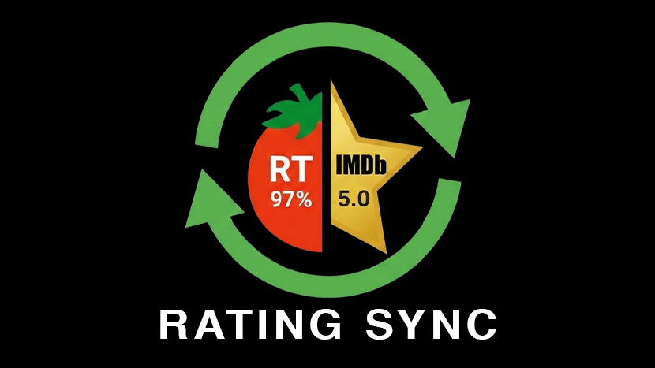

<p align="center">
	
</p>

<h1 align="center">Rating Sync</h1>

<p align="center">
	An Emby plugin to sync <b>IMDb community ratings</b> and <b>Rotten Tomatoes critic ratings</b> into your library metadata.
	<br />
	Smart scanning • Rate limiting • Progress tracking • Scan history
</p>

<p align="center">
	<a href="#features">Features</a> •
	<a href="#install">Install</a> •
	<a href="#quick-start">Quick start</a> •
	<a href="#ui-tour">Screenshots</a> •
	<a href="https://github.com/pejamas/rating-sync/releases">Download</a>
</p>

<p align="center">
	<a href="https://github.com/pejamas/rating-sync/actions/workflows/ci.yml"></a>
	<a href="https://github.com/pejamas/rating-sync/releases"></a>
	<a href="https://github.com/pejamas/rating-sync/releases"></a>
	<a href="LICENSE"></a>
</p>

## Features

- Updates **Movies**, **Series**, and optionally **Episodes**
- Supports **OMDb** and/or **MDBList** (configurable preferred source)
- Optional **IMDb scraping fallback** for episode ratings
- Built-in **rate limiting** + daily limits per API
- **Smart scanning**: rescan interval, prioritize recently added, skip already-rated (optional)
- **Progress API** + detailed results (updated/skipped/errors)
- **Scan history** + per-session reports
- Missing data views (e.g., missing IMDb id / ratings) and item-level scan history

## Install

1. Download `RatingSync.dll` from the latest GitHub Release.
2. Copy it into your Emby plugins folder (commonly `...\Emby-Server\programdata\plugins\`).
3. Restart Emby Server.
4. Configure API keys in Emby Dashboard → Plugins → Rating Sync.

## Quick start

1. Add at least one API key (OMDb and/or MDBList).
2. Pick your preferred rating source and what item types to update.
3. (Optional) Enable episode scraping fallback if you want episode ratings.
4. Go to the **Run** tab and start a refresh.

## UI tour

### Settings

Configure API keys, rating sources, item types, and rate limiting.


### Smart scanning

Avoid redundant API calls by controlling how often items are rescanned and prioritizing recently added content.


### Run

Trigger a refresh manually. You can run it for an entire library, or target a specific series/season/episode.


### Scan report

After a scan, open the report for a detailed breakdown (updated/skipped/errors, API usage, and searchable results).


### History

Browse recent scans, find items with missing data, and inspect item-level scan history.


> Screenshot files live in `docs/screenshots/`.

## Build

```powershell
dotnet build -c Release
```

Output:
- `bin\Release\RatingSync.dll`

### Building against a local Emby install (optional)

If you have Emby installed locally, you can build against its `System` DLLs:

```powershell
dotnet build -c Release -p:EmbyPath="C:\Program Files\Emby-Server\System"
```

## Release process (automated)

This repo is set up so that pushing a tag like `v1.2.3` will:
- Build `Release`
- Create a GitHub Release
- Upload `RatingSync.dll` (and a zip) as release assets

See [RELEASING.md](RELEASING.md).

## Versioning

Uses Semantic Versioning: `MAJOR.MINOR.PATCH`
- **PATCH**: bug fixes, small changes
- **MINOR**: new features (backwards compatible)
- **MAJOR**: breaking behavior/config/API changes
